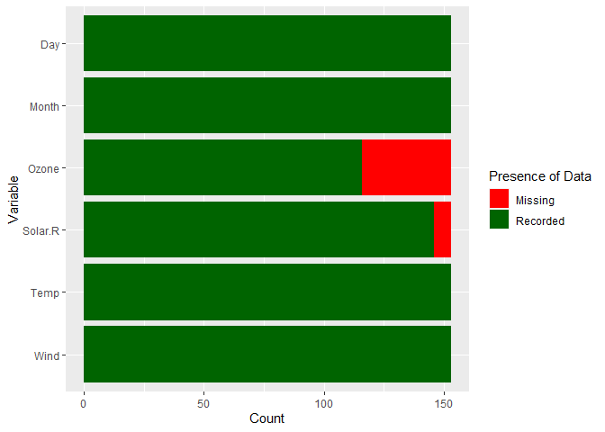
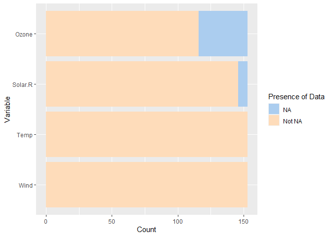
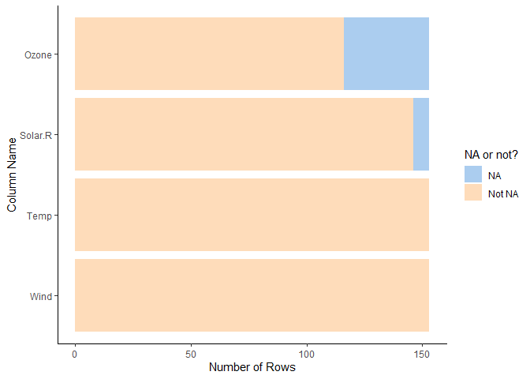

<!-- README.md is generated from README.Rmd. Please edit that file -->

# plotMissing

<!-- badges: start -->
<!-- badges: end -->

The goal of the `plotMissing` library is to allow users to easily plot
the number of missing values for each column in a `tibble` object. All
of the plot-generating functions in this library are designed to
interact with the `tidyverse` set of packages, and the functions are
designed to give users a wide range of flexibility and customization.

The `plotMissing::plotMissing` function generates a stacked column plot
depicting the number of missing (`NA`) and observed (non-`NA`) values
for each selected column in a tibble. The package provides built-in
customization options including changing the colours of the bars, the
names shown in the legend, and selecting a subset of the columns to
plot.

The `plotMissing::plotMissing` function is partially based on the
[`missingno`](https://github.com/ResidentMario/missingno) Python library
(in particular, the `msno.bar` function) in Python, with many additional
customization options for the resulting plot built directly into the
function.

## Installation

You can install the development version of plotMissing from
[GitHub](https://github.com/) with:

``` r
# install.packages("devtools")
devtools::install_github("stat545ubc-2023/plotMissing")
```

## Examples

Because the `plotMissing` function produces a `ggplot2` object, it would
be helpful to cover a few visual examples of the outputs of this
function to demonstrate what the different parameters in the function
represent.

``` r
library(plotMissing)

# Load in a dataset and coerce it to a tibble
airquality <- tibble::tibble(datasets::airquality)
```

### Basic function call

``` r
plotMissing(airquality)
```



### Changing the plot with the built-in function parameters

``` r
plotMissing(airquality, 
            cols = tidyselect::starts_with(c("O", "S", "T", "W")),
            count_names = c("NA", "Not NA"),
            bar_colours = c("#ABCDEF", "#FEDCBA"))
```



### Adding additional graphical parameters with the `...` argument

``` r
plotMissing(airquality, 
            ggplot2::theme_classic(),
            ggplot2::labs(x = "Column Name", y = "Number of Rows",
                          fill = "NA or not?"),
            cols = tidyselect::starts_with(c("O", "S", "T", "W")),
            count_names = c("NA", "Not NA"),
            bar_colours = c("#ABCDEF", "#FEDCBA"))
```



## Future Updates

There are some future updates planned for the `plotMissing` package
which are meant to improve the ‘customizability’ of the plots which the
package generates. The future features include the following:

- Create plots for only one “group” (e.g. only display the number of
  missing values per column)
- Improving the language for the `count_names` and `bar_colours`
  parameters to make them more intuitive
- Customizing the order of the bars in the plot
- Letting the users decide whether the coordinates should be flipped
- Letting users decide which bar (missing values or observed values) is
  on the left
